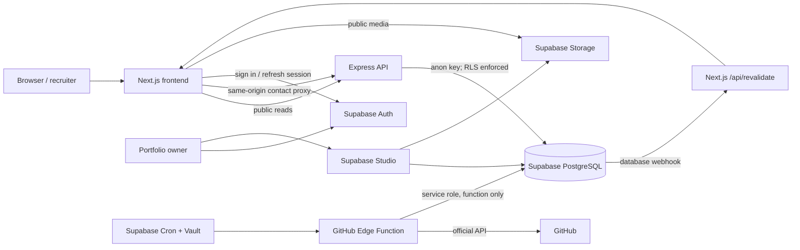
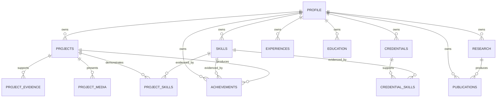

# CareerOS

CareerOS is a database-driven professional portfolio built as an evidence graph. Instead of presenting skills as unsupported claims, it connects each skill to projects, credentials, achievements, research, publications, and verifiable evidence.

This repository is also a reference architecture for building a secure, content-managed public site with:

- a Next.js 14 frontend;
- an Express API boundary;
- Supabase PostgreSQL, Auth, Storage, Row Level Security (RLS), Cron, Vault, and Edge Functions;
- privacy-preserving analytics and a protected contact workflow;
- cache invalidation from database webhooks; and
- ordered CI/CD deployments to Supabase and Vercel.

> The migrations include portfolio content specific to this CareerOS instance. If you are using the repository as a template, read [Adapt this project](#adapt-this-project-for-another-portfolio) before applying the migrations.

## Table of contents

- [What the system does](#what-the-system-does)
- [Architecture](#architecture)
- [Repository map](#repository-map)
- [Technology and design decisions](#technology-and-design-decisions)
- [Data model](#data-model)
- [Request and data flows](#request-and-data-flows)
- [Prerequisites](#prerequisites)
- [A-to-Z local setup](#a-to-z-local-setup)
- [Content administration](#content-administration)
- [GitHub synchronization](#github-synchronization)
- [Caching and immediate revalidation](#caching-and-immediate-revalidation)
- [Testing and quality checks](#testing-and-quality-checks)
- [Production deployment](#production-deployment)
- [Security and privacy model](#security-and-privacy-model)
- [API reference](#api-reference)
- [Common development workflows](#common-development-workflows)
- [Troubleshooting](#troubleshooting)
- [Adapt this project for another portfolio](#adapt-this-project-for-another-portfolio)
- [Documentation to maintain beyond this README](#documentation-to-maintain-beyond-this-readme)

## What the system does

The public application exposes:

- a recruiter-focused home page assembled from featured records;
- project case studies with skill, evidence, media, and achievement links;
- skill-to-evidence exploration;
- experience, education, certification, research, achievement, and writing views;
- a dynamically generated PDF CV;
- a contact form with validation, rate limiting, a honeypot, and write-only public database access;
- cookie-free, low-data analytics; and
- SEO metadata, Open Graph imagery, `robots.txt`, and a generated sitemap.

The owner workflow provides:

- Supabase Auth login at `/admin/login`;
- owner-only access based on the `portfolio_owner` JWT app-metadata claim;
- content editing through Supabase Table Editor;
- private staging and public evidence buckets; and
- review-first GitHub imports.

The current `/admin` route is a protected operational handoff page, not a full CRUD dashboard. Record editing is performed in Supabase Studio/Table Editor.

## Architecture



### Trust boundaries

1. **Browser to Next.js:** public pages and same-origin application routes.
2. **Next.js to Express:** the frontend consumes one stable API contract. Contact submissions are proxied so browsers do not need to call the backend origin directly.
3. **Express to Supabase:** Express uses the anonymous key. RLS, not possession of a server key, decides what may be read or inserted.
4. **Owner to Supabase:** authenticated owner operations require a signed-in user whose JWT contains `app_metadata.portfolio_owner = true`.
5. **Edge Function to Supabase:** only the scheduled integration runs with the platform-provided service-role key. Its endpoint is protected by a separate cron secret.

This separation prevents a frontend or API compromise from automatically becoming unrestricted database access.

## Repository map

```text
career_os/
├── .github/workflows/ci-cd.yml       # validation and ordered production release
├── backend/                           # Express API
│   ├── api/index.js                   # Vercel serverless entry point
│   ├── controllers/                   # contact and analytics validation
│   ├── routes/api.js                  # public API routes and rate limits
│   ├── services/skillEvidence.js      # evidence-graph aggregation
│   ├── test/                          # Node test runner suites
│   ├── server.js                      # Express composition/local listener
│   └── vercel.json                    # backend deployment routing
├── frontend/                          # Next.js App Router application
│   ├── public/                        # static images
│   ├── src/app/                       # pages, route handlers, components, copy loaders
│   ├── src/middleware.js              # admin authentication/authorization
│   └── next.config.mjs                # redirects and Next.js configuration
├── supabase/
│   ├── functions/github-sync/         # scheduled GitHub importer
│   ├── migrations/                    # canonical, ordered database contract
│   └── config.toml                    # local/project Supabase configuration
├── DEPLOYMENT.md                      # concise production runbook
└── README.md                           # system and implementation guide
```

`remote-schema-before-reconcile.sql` is a historical schema snapshot, not the source of truth. Versioned files in `supabase/migrations/` are canonical.

## Technology and design decisions

| Concern | Choice | Reason |
|---|---|---|
| Web application | Next.js App Router + React | Server rendering, metadata routes, route handlers, and cache tags |
| Public API | Express | Stable application boundary independent of the UI |
| Persistence | Supabase PostgreSQL | Relational evidence graph, constraints, and managed operations |
| Authorization | Supabase RLS | Database remains the final enforcement layer |
| Owner identity | Supabase Auth | Password session with refresh-token rotation in HTTP-only cookies |
| Media | Supabase Storage | Separate private staging and public approved evidence |
| Integration | Supabase Edge Function | Scheduled GitHub ingestion close to the database |
| Hosting | Two Vercel projects | Frontend and backend deploy and scale independently |
| CI/CD | GitHub Actions | Enforces database → API → frontend release order |

## Data model

The core is a relational evidence graph:



Supporting groups include:

- **Presentation:** `site_content` stores page copy and navigation as JSONB.
- **Operations:** `contacts`, `analytics_events`, and `private_profile_contacts`.
- **Integrations:** `integrations`, `integration_accounts`, `incoming_events`, `sync_runs`, `external_items`, and `publication_jobs`.
- **Storage:** public `project-evidence` and private `project-evidence-staging` buckets.

Most publishable records share four controls:

- `visibility`: `public`, `unlisted`, or `private`;
- `featured`: whether the record is promoted on aggregate views;
- `display_order`: explicit editorial ordering where supported; and
- `verification_status` / `verification_url`: the strength and location of evidence.

## Request and data flows

### Public page read

1. A Next.js server component calls a loader in `frontend/src/app/data.js`.
2. The loader calls the Express URL in `NEXT_PUBLIC_API_URL`.
3. Express queries Supabase with the anonymous key.
4. RLS returns only rows allowed for public access.
5. Next.js caches the result under route-specific tags, normally for 300 seconds.
6. The server-rendered page is returned to the visitor.

### Contact submission

1. The browser posts to the same-origin Next.js `/api/contact` route.
2. Next.js forwards the raw JSON body to Express with a ten-second timeout.
3. Express limits requests to five per 15 minutes per origin/IP pair.
4. The controller rejects unknown fields, validates lengths and email format, normalizes email, and silently accepts honeypot submissions without storing them.
5. Supabase checks the same important constraints again.
6. Anonymous users may insert approved columns but cannot read contact rows.

### Analytics event

1. The client sends one of the allow-listed event names to `/api/analytics/events`.
2. Express validates the path and optional subject/referrer fields and rate-limits the endpoint.
3. Only event name, local path, optional subject identifiers, referrer hostname, and timestamp are stored.
4. Cookies, IP addresses, full referrer URLs, message bodies, and cross-site identifiers are intentionally excluded.

### GitHub import

1. Supabase Cron invokes the Edge Function with `x-sync-secret`.
2. The function selects connected GitHub accounts that are due for synchronization.
3. It fetches public, non-fork repositories through GitHub's official API.
4. Source data is upserted into `external_items` with `review_status = pending` unless an existing review state should be preserved.
5. A human approves and maps suitable source records to canonical public records.
6. Failures use exponential backoff and are recorded in `sync_runs`.

## Prerequisites

Install or create:

- Git;
- Node.js 20 LTS and npm;
- Docker Desktop or another Docker-compatible runtime, if using the local Supabase stack;
- Supabase CLI (the commands below use `npx supabase` so a global install is optional);
- a Supabase project for hosted development/production;
- two Vercel projects for production: one rooted at `backend`, one rooted at `frontend`;
- a GitHub account and repository for CI/CD; and
- optionally, a fine-grained GitHub read token for higher API limits.

Confirm the local tools:

```bash
node --version
npm --version
docker --version
npx supabase --version
```

Use Node 20 to match CI.

## A-to-Z local setup

There are two workable database approaches:

- **Recommended for isolated development:** run Supabase locally with Docker.
- **Fastest hosted setup:** link a development Supabase project and apply migrations to it.

Do not point routine local development at production.

### 1. Clone and inspect the repository

```bash
git clone <your-repository-url> career_os
cd career_os
git status
```

If this will become another person's portfolio, customize the content-bearing migrations before the first database reset or push. See [Adapt this project](#adapt-this-project-for-another-portfolio).

### 2. Install application dependencies

The frontend and backend are separate Node applications; there is no root application script.

```bash
cd backend
npm ci
cd ../frontend
npm ci
cd ..
```

Use `npm install` only when intentionally changing dependencies and lockfiles.

### 3A. Start a local Supabase stack

From the repository root:

```bash
npx supabase start
npx supabase db reset
```

`db reset` recreates the local database and applies every migration in filename order. It is destructive to the **local** Supabase database, so do not use it against data you need to retain.

After startup, note the local API URL, anonymous key, Studio URL, and service-role key printed by the CLI. The web applications need only the API URL and anonymous key.

Useful local commands:

```bash
npx supabase status
npx supabase stop
```

### 3B. Or configure a hosted development Supabase project

Create a separate project in Supabase, then run:

```bash
npx supabase login
npx supabase link --project-ref <development-project-ref>
npx supabase db push --dry-run
npx supabase db push
```

Review the dry run before applying it. Never edit a migration that has already been deployed; add a new forward-only migration.

### 4. Configure the backend environment

```bash
cp backend/.env.example backend/.env
```

Set the values in `backend/.env`:

```dotenv
PORT=5000
FRONTEND_URL=http://localhost:3000
DEVELOPMENT_ORIGINS=http://localhost:3000
REQUEST_BODY_LIMIT=16kb
SUPABASE_URL=http://127.0.0.1:54321
SUPABASE_ANON_KEY=<local-or-hosted-anonymous-key>
```

For a hosted development database, replace the last two values with the project URL and publishable/anonymous key.

`FRONTEND_URL` and every comma-separated `DEVELOPMENT_ORIGINS` entry must be an exact origin: scheme, hostname, and optional port, with no path. Never put a service-role key here.

### 5. Configure the frontend environment

```bash
cp frontend/.env.example frontend/.env.local
```

Set:

```dotenv
NEXT_PUBLIC_API_URL=http://localhost:5000/api
NEXT_PUBLIC_SITE_URL=http://localhost:3000
NEXT_PUBLIC_SUPABASE_URL=http://127.0.0.1:54321
NEXT_PUBLIC_SUPABASE_ANON_KEY=<local-or-hosted-anonymous-key>
PORTFOLIO_OWNER_EMAILS=owner@example.com
REVALIDATE_SECRET=<long-random-development-secret>
```

Generate a secret with a password manager or, for example:

```bash
openssl rand -hex 32
```

Only variables prefixed with `NEXT_PUBLIC_` are exposed to browser bundles. `PORTFOLIO_OWNER_EMAILS` and `REVALIDATE_SECRET` are server-only and must not receive that prefix.

### 6. Start both applications

Terminal 1:

```bash
cd backend
npm run dev
```

Terminal 2:

```bash
cd frontend
npm run dev
```

Open:

- frontend: <http://localhost:3000>
- API aggregate check: <http://localhost:5000/api/home>
- local Supabase Studio: normally <http://127.0.0.1:54323>

The frontend has no silent API fallback. If `NEXT_PUBLIC_API_URL` is missing or wrong, data-backed pages report an unavailable state.

### 7. Create and authorize the owner account

1. In Supabase Dashboard/Studio, open **Authentication → Users**.
2. Create the owner user with email and password, or invite the owner.
3. Set the user's app metadata to:

   ```json
   { "portfolio_owner": true }
   ```

4. Sign out and back in after changing metadata so the JWT contains the claim.
5. Open <http://localhost:3000/admin/login> and sign in.

The `PORTFOLIO_OWNER_EMAILS` variable is a web-middleware fallback for identifying the owner session, but database write policies check the JWT claim. Therefore the app-metadata claim is required for full owner database access.

Do not put this flag in user-editable `user_metadata`.

### 8. Verify the core system

Check these paths:

```bash
curl --fail http://localhost:5000/api/home
curl --fail http://localhost:5000/api/projects
curl --fail http://localhost:3000/
```

Then manually verify:

- a project detail page opens;
- `/skills` loads connected evidence;
- `/cv/download` returns a PDF;
- a valid contact form returns success;
- an invalid contact body returns `422`;
- `/admin` redirects unauthenticated visitors to `/admin/login`;
- approved public Storage media renders; and
- `robots.txt` and `sitemap.xml` use the expected site URL.

## Content administration

### Publishing sequence

For a new portfolio, create records in dependency order:

1. `profile`;
2. `skills`;
3. `projects`, `credentials`, `experiences`, `education`, and `research`;
4. link tables `project_skills` and `credential_skills`;
5. `project_evidence`, `project_media`, `achievements`, and `publications`;
6. `site_content` copy; and
7. set `visibility`, `featured`, `display_order`, and verification fields only after review.

Use stable, URL-safe, lowercase slugs such as `cloud-security-review`. Do not reuse slugs for unrelated records because routes and cache tags depend on them.

### Evidence media workflow

1. Upload candidate PNG, JPEG, WebP, or PDF files to the private `project-evidence-staging` bucket.
2. Check for secrets, customer data, tokens, active findings, personal information, unsafe metadata, and unredacted reports.
3. Sanitize the file outside the public bucket.
4. Upload the approved version to the public `project-evidence` bucket.
5. Create a visible `project_media` record with its storage path, accurate media type, useful alt text, verification status, and display order.
6. Confirm the anonymous public page can access the file.

Never publish merely because an item was imported or uploaded.

### Database-driven copy

Page headings, labels, SEO text, navigation, and operational guidance live in `site_content.content` JSONB. Preserve each page's expected JSON shape when editing it. A malformed but valid JSON object can still result in missing UI copy.

## GitHub synchronization

This integration is optional. Public GitHub repositories can be queried without a token at lower rate limits.

### Deploy the function

```bash
npx supabase functions deploy github-sync --no-verify-jwt
npx supabase secrets set SYNC_CRON_SECRET=<long-random-secret>
npx supabase secrets set GITHUB_SYNC_TOKEN=<optional-fine-grained-read-token>
```

`verify_jwt` is disabled because Cron does not use a user JWT. The endpoint is instead protected by the high-entropy `SYNC_CRON_SECRET`. Supabase provides `SUPABASE_URL` and `SUPABASE_SERVICE_ROLE_KEY` to the deployed function; do not copy the service-role key into either web application.

### Configure the account

In `integration_accounts`, ensure the GitHub account:

- references the GitHub integration;
- has the correct GitHub username in `external_account_id`;
- has `status = connected`;
- has a suitable `sync_interval_minutes`; and
- has `next_sync_at` null or due when the first run should occur.

The repository's seed data contains the current owner's GitHub username. Replace it when adapting the project.

### Schedule it

Enable Supabase Cron/`pg_cron`, `pg_net`, and Vault as required by your project. Store these Vault secrets:

- `project_url`: the Supabase project URL;
- `github_sync_cron_secret`: the exact value used for `SYNC_CRON_SECRET`.

Then schedule the call using the SQL in `supabase/functions/github-sync/README.md`. It runs every 15 minutes while per-account `next_sync_at` prevents unnecessary requests.

Test manually before relying on the schedule:

```bash
curl --fail --request POST \
  --header "x-sync-secret: <secret>" \
  --header "content-type: application/json" \
  --data '{}' \
  https://<project-ref>.supabase.co/functions/v1/github-sync
```

Inspect `sync_runs`, `integration_accounts`, and `external_items`. Imported items should remain pending until reviewed.

LinkedIn synchronization is intentionally disabled until approved OAuth access exists; scraping is not an acceptable integration strategy. Credly records should use official verification or embed URLs.

## Caching and immediate revalidation

Most frontend data is cached for 300 seconds; certifications use 60 seconds. A database webhook can make committed content changes visible immediately.

In Supabase, create one Database Webhook for `INSERT`, `UPDATE`, and `DELETE` on:

```text
profile, projects, skills, experiences, education, credentials, research,
achievements, publications, site_content, project_skills, project_evidence,
project_media
```

Configure:

- URL: `https://<frontend-domain>/api/revalidate`
- HTTP header: `x-revalidate-secret: <same value as frontend REVALIDATE_SECRET>`

The route validates the secret, schema, and table allow-list, then invalidates the home aggregate, affected collections, page copy, and project tags before revalidating the layout. Time-based revalidation remains the fallback.

## Testing and quality checks

### Automated checks

Backend:

```bash
cd backend
npm test
```

Frontend:

```bash
cd frontend
npm run lint
npm run build
```

The production build needs the frontend variables to exist, even when placeholder `.invalid` URLs are used in CI.

### Database checks

Before deploying:

```bash
npx supabase db push --dry-run
```

Also run Supabase's database/security advisors and manually test RLS as:

- anonymous user: reads only public content, inserts valid contacts/analytics, cannot read private operational rows;
- ordinary authenticated user: receives no owner privileges;
- owner user: can manage portfolio content; and
- Edge Function: can perform only its intended integration workflow despite having elevated credentials.

### Manual release checklist

- Test at 375 px, 768 px, and 1440 px widths.
- Navigate the full site with a keyboard.
- Verify focus visibility, semantic headings, form labels, and image alt text.
- Test with reduced motion enabled.
- Confirm empty, loading, API-unavailable, validation-error, 404, and global error states.
- Check canonical metadata, Open Graph image, sitemap, and robots rules.
- Submit contact and analytics events and inspect stored rows for data minimization.
- Verify private and unlisted records never appear in anonymous API responses.
- Confirm CV content and generated filename.

## Production deployment

The safe dependency order is:

```text
Database migrations → Edge Functions → Express API → Next.js frontend → smoke tests
```

The workflow in `.github/workflows/ci-cd.yml` implements this order on pushes to `main`. Pull requests run backend tests plus frontend lint/build without deploying.

### 1. Create two Vercel projects

- Backend project root directory: `backend`
- Frontend project root directory: `frontend`

Configure the backend project with:

- `SUPABASE_URL`
- `SUPABASE_ANON_KEY`
- `FRONTEND_URL=https://<frontend-domain>`
- optional `DEVELOPMENT_ORIGINS`
- optional `PORT` and `REQUEST_BODY_LIMIT`

Configure the frontend project with:

- `NEXT_PUBLIC_API_URL=https://<backend-domain>/api`
- `NEXT_PUBLIC_SITE_URL=https://<frontend-domain>`
- `NEXT_PUBLIC_SUPABASE_URL`
- `NEXT_PUBLIC_SUPABASE_ANON_KEY`
- `PORTFOLIO_OWNER_EMAILS`
- `REVALIDATE_SECRET`

Changing a `NEXT_PUBLIC_` variable requires rebuilding/redeploying the frontend.

### 2. Configure GitHub Actions secrets

Set repository or production-environment secrets:

- `SUPABASE_ACCESS_TOKEN`
- `SUPABASE_DB_PASSWORD`
- `SUPABASE_PROJECT_ID`
- `VERCEL_TOKEN`
- `VERCEL_ORG_ID`
- `VERCEL_BACKEND_PROJECT_ID`
- `VERCEL_FRONTEND_PROJECT_ID`

Use a protected GitHub `production` environment when database changes require approval.

### 3. Make CI/CD the deployment authority

Disable Vercel's automatic Git production deployment for both projects. Otherwise the frontend can deploy before its schema or API dependencies.

### 4. Preview and release

Before merging:

```bash
cd backend && npm test
cd ../frontend && npm run lint && npm run build
cd ..
npx supabase db push --dry-run
```

Merge through `main`, monitor every workflow job, and run production smoke tests against both deployment URLs. For detailed operational notes, see [DEPLOYMENT.md](DEPLOYMENT.md).

### Rollback model

- Roll back application code by deploying a known-good commit.
- Treat database migrations as forward-only.
- If a schema change is wrong, add a corrective migration; do not modify an already-deployed migration.
- Back up production before material data or schema changes.

## Security and privacy model

### Controls already implemented

- RLS enabled on public, private, operational, and integration tables.
- Anonymous reads filtered by `visibility = public`.
- Owner writes authorized by a non-user-editable JWT app-metadata claim.
- No service-role key in the frontend or Express runtime.
- Public contacts are insert-only with column grants and database constraints.
- Contact validation, body-size limits, honeypot protection, and rate limiting.
- Analytics event allow-list and minimal stored fields.
- Private evidence staging before public release.
- Secret-protected cache and Cron endpoints.
- Review-first integration imports with retries and audit records.
- Admin pages excluded from search indexing.

### Production hardening responsibilities

- Rotate leaked or stale credentials immediately.
- Keep `.env`, `.env.local`, tokens, database dumps, and Supabase temp state out of Git.
- Restrict GitHub/Vercel/Supabase tokens to the least privilege possible.
- Enable MFA for infrastructure accounts.
- Review Supabase security and performance advisors.
- Define retention/deletion periods for contacts, analytics, sync logs, and staging files.
- Add monitoring and alerting for API failures, function failures, and unusual contact volume.
- Keep Node, Next.js, Express, Supabase client, and GitHub Actions pinned and patched.
- Verify rate-limit behavior in serverless production; use a shared durable rate-limit store if strict global enforcement is required across instances.

## API reference

All Express endpoints are below the `/api` base path.

| Method | Route | Purpose |
|---|---|---|
| `GET` | `/home` | Featured home-page aggregate and copy |
| `GET` | `/profile` | Public profile collection |
| `GET` | `/projects` | Public projects ordered for display |
| `GET` | `/projects/:slug` | Project with skills, evidence, media, and achievements |
| `GET` | `/skills` | Public skills |
| `GET` | `/skills/:slug/evidence` | One skill and connected public proof |
| `GET` | `/experiences` | Public experience records |
| `GET` | `/education` | Public education records |
| `GET` | `/credentials` | Public credential records |
| `GET` | `/certifications` | Public certifications with editorial ordering |
| `GET` | `/research` | Public research records |
| `GET` | `/achievements` | Public achievement records |
| `GET` | `/publications` | Public writing/publication records |
| `GET` | `/site-content/:pageKey` | Published JSONB copy for a page |
| `POST` | `/contact` | Validate and store a contact submission |
| `POST` | `/analytics/events` | Store an allow-listed privacy event |

Application route handlers in Next.js:

| Method | Route | Purpose |
|---|---|---|
| `POST` | `/api/contact` | Same-origin proxy to Express contact endpoint |
| `POST` | `/api/revalidate` | Secret-protected database webhook receiver |
| `GET` | `/cv/download` | Generate a one-page PDF CV from current records |

Expected error responses use an `error` object with a stable `code` and a user-safe `message`. Validation errors may also include a `fields` map.

## Common development workflows

### Add a schema change

```bash
npx supabase migration new <descriptive_name>
```

Edit the new SQL file, reset the local database, run application tests, inspect the diff/dry run, and commit the migration with any compatible API/UI changes.

### Add a new public record type

1. Add the table, constraints, indexes, and RLS policies in a migration.
2. Grant only the required columns/actions.
3. Add the table to owner policies if the owner should manage it.
4. Add an Express route and explicit public projection.
5. Add a cached frontend loader and cache tag.
6. Build its page and empty/error states.
7. Add it to webhook allow-lists and tag mapping where appropriate.
8. Add tests and update the API/data-model documentation.

### Change public page copy

For a one-off local edit, update `site_content` in Studio. For a repeatable environment change, create a new idempotent migration that updates the relevant JSONB keys. Trigger or verify cache revalidation afterward.

### Add an integration

Model the external account separately from canonical content. Store raw source items, sync runs, retry state, and review status; keep credentials in a secret store; use the provider's official API; and require an explicit mapping/publish step.

## Troubleshooting

### Frontend says portfolio data is unavailable

- Confirm the backend is running.
- Confirm `NEXT_PUBLIC_API_URL` includes `/api` and has no accidental duplicate path.
- Request `/api/home` directly from the backend.
- Restart Next.js after changing `.env.local`.
- Inspect backend logs for missing Supabase variables or RLS errors.

### Backend starts but every data request returns 500

- Confirm `SUPABASE_URL` and `SUPABASE_ANON_KEY` are set in `backend/.env`.
- Confirm all migrations were applied.
- Query the affected table as the anonymous role and check its RLS policy.
- Never “fix” this by substituting the service-role key.

### Browser receives a CORS error

- Set `FRONTEND_URL` to the exact production frontend origin.
- Add local origins to `DEVELOPMENT_ORIGINS`, separated by commas.
- Remove paths and trailing slashes.
- Redeploy/restart the backend after changing its environment.

### Owner can log in but cannot edit records

- Confirm `app_metadata.portfolio_owner` is the boolean `true`, not the string `"true"`.
- Refresh the session by signing out and in.
- Confirm the database function/policies are present.
- Remember that the current protected admin page does not provide CRUD forms; use Supabase Studio.

### Content changes are delayed

- Confirm the Database Webhook includes the affected table and event.
- Confirm its `x-revalidate-secret` exactly matches `REVALIDATE_SECRET`.
- Inspect webhook delivery responses; `401` means secret mismatch and `400` means an unsupported payload/table.
- Wait for the 300-second time fallback if webhook delivery is unavailable.

### GitHub sync returns 401 or imports nothing

- Match `x-sync-secret` to `SYNC_CRON_SECRET`.
- Confirm the account is `connected` and `next_sync_at` is due.
- Confirm the GitHub username in `external_account_id`.
- Inspect `sync_runs` and `integration_accounts.consecutive_failures`.
- Add a fine-grained read token if unauthenticated API limits are exhausted.

### Contact returns 422

Send only `name`, `email`, `message`, and optional `website`. Name must be 2–100 characters, email 5–254 with a valid format, and message 10–5000. The hidden `website` field must stay empty for real users.

## Adapt this project for another portfolio

Use the architecture, but replace the identity and editorial data deliberately.

Before the first migration is applied:

1. Review every file in `supabase/migrations/`, especially seed and positioning migrations.
2. Replace profile names, email addresses, location, biography, links, GitHub username, project/skill/credential content, and page copy.
3. Replace profile images under `frontend/public/` and verify image references.
4. Update product name, metadata, site origin, social links, CV output, and Open Graph content.
5. Decide whether every current table and integration is needed.
6. Preserve the security migrations and evidence-review pattern even if the content model is simplified.
7. Apply the customized migration chain to a fresh local database and test it as anonymous, ordinary authenticated, and owner users.

If the original migrations have already been deployed, do **not** rewrite them. Add new corrective migrations that update or delete old content safely.

When designing a similar architecture from scratch, use this implementation order:

1. Define user journeys, public/private boundaries, and proof requirements.
2. Draw the domain/evidence model and identify ownership and lifecycle states.
3. Write database constraints and RLS before application CRUD.
4. Seed the smallest end-to-end content slice.
5. Build a read-only API using an RLS-constrained key.
6. Build server-rendered pages with explicit empty and failure states.
7. Add owner identity and administration.
8. Add protected operational writes such as contact and analytics.
9. Add private-to-public media review.
10. Add caching and authenticated invalidation.
11. Add integrations as inboxes with review queues, not direct publishers.
12. Add tests, observability, backup/restore, and ordered deployment automation.

## Documentation to maintain beyond this README

A README should orient and bootstrap. It should not carry every long-lived decision or operational procedure. Prioritize these documents:

| Priority | Document | What it should answer |
|---|---|---|
| 1 | [Architecture](docs/ARCHITECTURE.md) | Components, trust boundaries, data flows, failure modes, deployment topology, and scaling assumptions |
| 1 | [Data model](docs/DATA_MODEL.md) | ERD, table dictionary, constraints, visibility states, ownership, retention, and migration conventions |
| 1 | [Security](docs/SECURITY.md) | Threat model, RLS matrix, secrets, auth, abuse controls, vulnerability reporting, and incident handling |
| 1 | [Runbook](docs/RUNBOOK.md) | Deploy, rollback, recovery, secret rotation, cache failures, integration failures, and outage triage |
| 2 | [API](docs/API.md) | Endpoints, schemas, examples, errors, rate limits, authentication, and compatibility rules |
| 2 | [Contributing](CONTRIBUTING.md) | Branching, setup expectations, code style, tests, migration review, PR process, and definition of done |
| 2 | [Architecture decisions](docs/ADR/README.md) | Important choices, alternatives, consequences, and decision history |
| 2 | [Content guide](docs/CONTENT_GUIDE.md) | Editorial voice, JSONB content, slugs, verification, alt text, and publishing workflow |
| 2 | [Testing](docs/TESTING.md) | Test layers, fixtures, accessibility/browser matrix, RLS cases, and release acceptance criteria |
| 3 | [Changelog](CHANGELOG.md) | User-visible changes and migration/release notes |
| 3 | [Backup and restore](docs/BACKUP_RESTORE.md) | Backup scope, encryption, restoration drills, proposed RPO, and proposed RTO |
| 3 | [Privacy](docs/PRIVACY.md) | Collected data, purpose, proposed retention, deletion, processors, and user requests |
| 3 | [Observability](docs/OBSERVABILITY.md) | Logs, metrics, alerts, dashboards, redaction rules, and proposed service objectives |
| 3 | [License](LICENSE) and [Code of Conduct](CODE_OF_CONDUCT.md) | Reuse terms and community expectations |

Start with Architecture, Data Model, Security, and Runbook. Those four prevent the README from becoming unmaintainable and preserve the knowledge most likely to be needed during changes or incidents.

## Current limitations and next improvements

- The protected admin area is informational; a complete owner CRUD interface is not implemented.
- Backend tests cover contact and analytics validation, but endpoint integration, RLS, and end-to-end browser coverage should be expanded.
- Rate limiting uses process memory; distributed serverless enforcement needs a shared store.
- The generated PDF is intentionally simple and limited to one page/roughly 50 lines.
- Integration imports require a separate human mapping/publishing workflow.
- Formal monitoring, retention automation, and disaster-recovery drills are operational follow-ups.

## License

The repository is distributed under the [ISC License](LICENSE).
