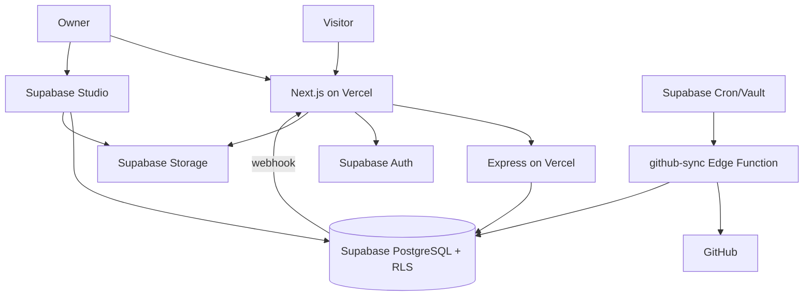

# Architecture

## Purpose

CareerOS is a public professional evidence platform. It separates presentation, application policy, persistence, administration, and ingestion so public workloads never need unrestricted database credentials.

## System context

## Containers and responsibilities

### Next.js frontend

- App Router pages, layouts, metadata, sitemap, robots rules, and Open Graph image.
- Server-side data loaders with tagged caching.
- Interactive filters, evidence explorer, analytics client, contact form, and theme state.
- Same-origin contact proxy and secret-protected revalidation route.
- Supabase password login, refresh cookies, owner route middleware, and dynamic PDF CV.

It does not query career tables directly. Supabase access in this layer is limited to Auth and public Storage URLs.

### Express API

- Stable `/api` contract for public data.
- Aggregation of home and skill-evidence views.
- Contact and analytics validation, request limits, CORS, and safe errors.
- Supabase access with the anonymous key so RLS remains authoritative.

### Supabase

- PostgreSQL stores normalized career records, content JSON, operational events, and integration state.
- RLS separates anonymous, authenticated non-owner, owner, and service-role access.
- Auth issues the owner session and JWT claim.
- Storage separates evidence staging from approved public media.
- Edge Functions perform privileged ingestion.
- Cron and Vault schedule calls without placing secrets in tables.

## Deployment topology

Production has two Vercel projects rooted at `backend/` and `frontend/`, one Supabase project, and one GitHub Actions workflow. The dependency order is database → functions → API → frontend. Vercel Git auto-deploy should be disabled so this order cannot be bypassed.

## Important flows

### Read path

`Browser → Next.js server component → Express → Supabase anon client → RLS → tagged Next.js cache → HTML`

### Contact path

`Browser → Next.js proxy → Express rate limit/validation/honeypot → contacts INSERT grant → DB constraints`

Anonymous clients cannot select contact rows.

### Owner path

`Owner → Next.js login action → Supabase Auth → HTTP-only access/refresh cookies → middleware claim check`

Database owner writes additionally require `app_metadata.portfolio_owner = true`. The email environment variable is only a web fallback and does not grant database privileges.

### Content update path

`Owner/Studio → row change → Supabase database webhook → /api/revalidate + shared secret → invalidate tags/layout`

The 300-second cache TTL remains a fallback.

### Integration path

`Cron → Edge Function secret check → GitHub official API → external_items(pending) → human review → canonical content`

## Failure behavior

| Failure | User behavior | Recovery |
|---|---|---|
| Express unavailable | Pages use explicit unavailable/empty states; contact returns 502 | Restore API; cached pages may continue temporarily |
| Supabase unavailable | Express returns safe 500 errors | Check provider/status/config and restore connectivity |
| Revalidation webhook fails | Stale content for up to cache TTL | Repair webhook; manually redeploy if urgent |
| GitHub rate limit/failure | Public site unaffected; sync backs off | Inspect `sync_runs`, token, and next run |
| Auth failure | Public site unaffected; admin login denied | Check Auth settings and claim/session |
| Storage object missing | Affected evidence media fails | Restore object or correct `project_media` path |

## Scaling assumptions

The site is read-heavy, single-owner, and low-write. Serverless API instances and cached server rendering fit that workload. Before materially increasing traffic or writers:

- move rate limiting to a durable shared store;
- load-test aggregate API queries;
- add pagination to collection endpoints;
- define connection and query budgets;
- introduce a complete audited admin UI; and
- revisit multi-tenant identity and RLS.

## Architectural invariants

1. Never place the service-role key in either web application.
2. Every exposed table has RLS and least-privilege grants.
3. External imports never publish directly.
4. Public evidence passes private staging and human review.
5. Deployed migrations are immutable and corrected forward.
6. Operational writes collect the minimum data required.
7. Database, API, and UI contract changes ship together.

See [ADRs](ADR/README.md) for decision history.

